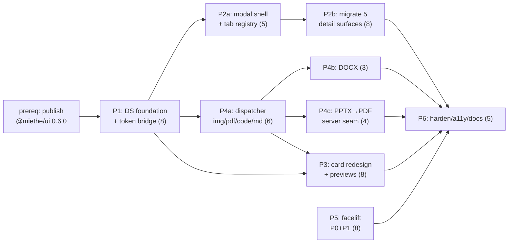

# Decisions Block: UI Polish Pass

<!-- Opus author. SPIKE verdict: CONDITIONAL GO. Two load-bearing constraints from adversarial
     verification drive the entire phase ordering: (1) @miethe/ui adoption is NOT clean — it needs a
     shadcn token bridge + build config before any component renders correctly; (2) PPTX has no React 19
     renderer — it requires a server-side PPTX→PDF seam. implementation-planner (sonnet) expands this. -->

**Feature Goal**: Bring Artifact Atlas to a polished, consistent UI by adopting the `@miethe/ui` design system, replacing five bespoke detail surfaces with one canonical tabbed-modal + full-page-route pattern, redesigning cards with real per-format asset previews, shipping a multi-format asset viewer (images/PDF/MD/DOCX/PPTX + formatted, editable code), and landing a prioritized facelift — while contributing reusable gaps upstream to `@miethe/ui`.

**This Decisions Block** captures phase boundaries, agent routing, risk hotspots, estimation anchors, and model routing. Opus authors this; `implementation-planner` (sonnet) expands it into the detailed Implementation Plan. Grounded in `docs/project_plans/spikes/ui-polish-pass-spike.md` (6 ADRs) and the five discovery legs under `.claude/worknotes/ui-polish-pass/discovery/`.

---

## 1. Phase Boundaries

Boundaries fall where the *shape* of the work changes (design-system foundation → pattern → components → subsystem → polish → hardening). Two phases (P2, P4) are 13 pts and **must be sub-split** by the planner (sub-phases noted in Scope).

| Phase | Name | Scope | Success Criteria | Exit Gate |
|-------|------|-------|------------------|-----------|
| **P1** | Design-system foundation | Add `@miethe/ui@0.6.0` (publish-from-source prerequisite). Author shadcn-compatible CSS-var + Tailwind-theme **token bridge** in `globals.css`; add dist content glob; `transpilePackages`/`serverExternalPackages`; single `@codemirror/state`; lucide/tailwind-merge dedupe. Prove `ContentPane` on **one** flagged screen. | `@miethe/ui` primitives render with correct tokens on the flagged screen; `tsc`+`next build` green; no CSS purge of library classes. | Token-bridge smoke screen renders; build passes; ADR-1 satisfied. **HARD GATE for all later phases.** |
| **P2** | Primitives & tabbed-modal pattern | Build canonical `BaseArtifactModal` (tabbed preview) + full-page route sharing **one tab registry**, URL-driven `?item=&tab=`, lazy `React.lazy`+`Suspense` panels. Migrate detail surfaces onto it. **Sub-split:** P2a = modal shell + tab registry + URL state + a11y (focus-trap/Escape); P2b = migrate Asset inspector, BOM `SlotDetailPanel`, Coverage inline sidebar, Template aside, Inbox column. | All 5 detail surfaces use the shared pattern; deep-linkable; focus-trap + Escape + restore work; old `RightDrawer`/bespoke panels removed. | a11y check (focus order, Escape, ARIA) passes on the modal; all 5 surfaces migrated; no orphaned drawer code. |
| **P3** | Card redesign & preview cards | Rebuild `AssetCard` (+ Pack/Slot/Template cards) on zone-composition model (Header/Content/Status/Action, tier sizing, `border-l-4` source tint) with full-width **top thumbnail** rendering a real per-format preview (image, PDF first page, code/MD snippet). Click-to-open guarded by `closest('button,a,input,[role=menuitem]')`. | Cards match mockups (top thumbnail), render real previews, open the P2 modal; keyboard + screen-reader accessible. | Visual parity with mockups; preview thumbnails render for each format; a11y pass. |
| **P4** | Multi-format asset viewer | `AssetViewer` dispatcher. **Sub-split:** P4a = dispatcher + images (`next/image`) + PDF (`react-pdf` 10.4.1, worker + CI version assert) + code/MD via `ContentPane` (code-only editable); P4b = DOCX (`docx-preview` 0.3.7); P4c = **PPTX server-side→PDF seam** (backend convert endpoint + render via `react-pdf`). Full untrusted-file security posture (sanitize, sandbox, no remote-ref fetch, CSP). | Every format renders; only code-like/markdown is editable, binaries read-only; PPTX converts + renders; untrusted-file safeguards verified. | Per-format render tests; security checklist signed off; PPTX seam works end-to-end behind a flag. |
| **P5** | Facelift pass | Leg-5 **P0** (Inter via `next/font`, `ink-faint` contrast bump to WCAG AA, `prefers-reduced-motion`, footer health probe) + **P1 core** (sidebar grouping + active accent bar, richer command-center `PageHeader`, BOM dotted-purple empty slots, dashboard row thumbnails + KPI deltas, readiness ring, board column accents, `EmptyState` surface icons). Dark mode **deferred** (P3-1). | P0 a11y/correctness defects fixed; P1 surfaces visibly match mockups. | axe contrast + reduced-motion pass; visual review vs mockups. |
| **P6** | Hardening, a11y & docs | `tsc`/`next build`/visual smoke gates; axe a11y sweep; update `docs/DECISIONS.md` + `docs/mvp-backlog.md`; align `shared/openapi.yaml` for the preview + PPTX-convert seams; demo data; e2e (Playwright). | All gates green; docs + OpenAPI aligned; e2e covers modal + viewer happy paths. | `task-completion-validator` + `karen` sign-off; CI green. |

**Boundary Rationale**:
- **P1→P2**: Nothing renders correctly until the token bridge + build config land (ADR-1, refuted "clean" adoption). P1 is the hard gate.
- **P2→P3**: The detail/modal pattern must exist before cards can wire click-to-open into it. Cards consume the pattern; the pattern doesn't depend on cards.
- **P3↔P4**: Cards need *preview renderers*; the viewer subsystem owns them. P4a renderers are a shared dependency for P3's real thumbnails — start P4a's dispatcher early so P3 thumbnails reuse it rather than forking.
- **P4 internal**: P4c (PPTX) is isolated behind a backend seam so its infra risk (LibreOffice/converter) can't block image/PDF/code/MD/DOCX.
- **P5**: P0 facelift items are independent of the design system and can start in parallel with P1; P1-card-tied facelift items depend on P3.
- **P6**: Cross-cutting validation last.

---

## 2. Agent Routing

| Phase | Primary Agent(s) | Secondary Agent | Notes |
|-------|------------------|-----------------|-------|
| P1 | `frontend-architect` | `nextjs-architecture-expert` | Token bridge, Tailwind theme, transpile/serverExternal config, `@codemirror/state` dedupe. Highest-judgment frontend phase. |
| P2 | `ui-engineer-enhanced` | `frontend-architect` (pattern API) + `a11y-sheriff` (focus-trap) | `codebase-explorer` first to map all 5 detail surfaces precisely (leg-1 has refs). |
| P3 | `ui-engineer-enhanced` | `ui-designer` (visual) + `codebase-explorer` (card usage map) | Reuses P4a preview renderers. |
| P4 | `ui-engineer-enhanced` (P4a/P4b) + `python-backend-engineer` (P4c seam) | `api-designer` (convert/preview contract) + `code-reviewer` (untrusted-file security) | P4c is the only backend work; keep behind feature flag. |
| P5 | `ui-engineer-enhanced` | `a11y-sheriff` (contrast/reduced-motion) + `ui-designer` | P0 items can run parallel to P1. |
| P6 | `task-completion-validator`, `karen` (gates) | `a11y-sheriff`, `documentation-writer`, `api-librarian` | OpenAPI alignment + docs + e2e. |

**Parallel Opportunities**:
- P5 **P0 facelift** (font/contrast/reduced-motion/footer) ∥ **P1** — different files, no design-system dependency.
- After P1: **P2** (modal pattern files) ∥ **P4a/P4c** (viewer + backend seam) — distinct file ownership; backend PPTX seam is fully independent.
- P3 must follow P1 and should follow **P4a** (to reuse renderers) — sequence P3 after P4a, parallel with P4b/P4c.

**Must sequence**: P1 → (everything). P2a → P2b. P4a → P3 thumbnails.

---

## 3. Risk Hotspots

### Risk 1: `@miethe/ui` token-bridge adoption (the "clean adoption" refutation)
- **Severity**: high
- **Rationale**: Adversarial verify **refuted** clean adoption — ~330 shadcn semantic class refs resolve to CSS vars AA lacks; content globs purge library CSS; the root barrel has no `'use client'` (RSC throw); `@codemirror/state` must be single-instance. Get this wrong and every `@miethe/ui` component renders unstyled or breaks the build.
- **Mitigation**: P1 is a hard gate with a single-screen `ContentPane` smoke proof. Bridge is **additive/reversible** (CSS vars + Tailwind theme extension only). Subpath-only imports. CI assertion on `@codemirror/state` dedupe. Do not start P2+ until P1 exit gate passes.

### Risk 2: `@miethe/ui@0.6.0` publish dependency (cross-repo)
- **Severity**: high
- **Rationale**: npm `latest` is a stale `0.3.0` missing `ArticleViewer` + form deps the plan assumes; the needed surface lives in skillmeat source as 0.6.0. AA cannot consume what isn't published → blocks P1.
- **Mitigation**: Treat "publish `@miethe/ui@0.6.0` from source" as an explicit P1 **prerequisite task**. Interim unblh: consume via `file:`/pnpm-workspace link to the skillmeat package during dev (resolve in OQ-1). Couple with the upstream additions plan (the upstream shiki/CM6 work can ride the same release).

### Risk 3: PPTX rendering (no React 19 renderer)
- **Severity**: medium
- **Rationale**: Only React PPTX lib is alpha (`@mkabatek/pptx-viewer`, 26MB, peerDep `^19.2.5` conflicts with AA's `^19.0.x`). Client rendering is not production-safe.
- **Mitigation**: Server-side PPTX→PDF conversion (LibreOffice headless / gotenberg — OQ-2), render via the existing `react-pdf` surface. Isolate as P4c behind a feature flag with a download fallback.

### Risk 4: Untrusted-file rendering (security)
- **Severity**: medium-high
- **Rationale**: Asset content can be agent- or user-supplied. Rendering DOCX/MD/SVG/HTML invites XSS, script execution, and SSRF via remote refs.
- **Mitigation**: Sanitize markdown/HTML (DOMPurify or rehype-sanitize); sandbox rendered output (iframe `sandbox`, no `allow-scripts`); strip/deny remote-ref fetching; enforce CSP. `code-reviewer` signs the P4 security checklist. (This stays within Mode A/C — **no Mode-D** triggers: no auth/payments/migrations/deletion.)

### Risk 5: Migration breadth / regression across 5 detail surfaces + all cards
- **Severity**: medium
- **Rationale**: Swapping every detail surface and card touches most screens; high regression surface.
- **Mitigation**: One shared pattern + tab registry (not 5 rewrites); migrate surface-by-surface (P2b) behind the new pattern; visual smoke + axe sweep + e2e in P6; keep PRs phase-scoped.

---

## 4. Estimation Anchors

### Total: 55 points

| Phase | Points | Reasoning Anchor |
|-------|--------|------------------|
| P1 | 8 | New design-system adoption with a non-trivial token bridge + build config; comparable to a Tailwind-preset migration. De-risked by SPIKE but fiddly; single-screen proof included. |
| P2 | 13 | New cross-cutting pattern + 5 surface migrations + URL state + a11y. Split P2a (5) / P2b (8). Comparable to a "unify all detail panels" refactor. |
| P3 | 8 | 4 card families rebuilt on a new composition model + real preview thumbnails. Mechanical once P1+P4a land. |
| P4 | 13 | Multi-format dispatcher (frontend) + a backend conversion seam. Split P4a (6) / P4b (3) / P4c (4). Anchored on prior viewer/integration work. |
| P5 | 8 | P0 a11y/correctness (3) + P1 facelift surfaces (5). Many small, well-scoped edits across surfaces. |
| P6 | 5 | Gates + axe + docs + OpenAPI + e2e + demo data. Standard hardening tail. |

**Estimation Notes**:
- P2 and P4 exceed 8 pts → planner **must** sub-split per Scope column (P2a/P2b; P4a/P4b/P4c) so each task batch is ≤8 pts.
- Critical-path-inflating unknown: the `0.6.0` publish + token bridge (P1). If P1 slips, all downstream slips.
- Tech-debt payoff: removing `RightDrawer` + 4 bespoke panels and the placeholder `AssetPreview` reduces net surface.

---

## 5. Dependency Map

**Critical Path**: `publish 0.6.0` → **P1** (token bridge) → **P2a** (modal shell) → **P2b** (migrations) → **P6**; in parallel **P1** → **P4a** → **P4b/P4c** → **P6**; **P3** hangs off **P1 + P4a**.

**Parallelizable Slices**:
- P5-P0 facelift ∥ P1 (font/contrast/reduced-motion/footer — independent files).
- P2 (modal pattern) ∥ P4a/P4c (viewer + backend seam) — distinct ownership.
- P4b (DOCX) ∥ P4c (PPTX) — independent renderers.

---

## 6. Model Routing

Default execution → **sonnet** (per repo delegation economics + ICA free-tier preference). Reserve **opus** for the two highest-judgment design moments (P1 token-bridge design, P2a pattern API). Reviewers per their agent defaults.

| Phase | Agent | Model | Effort | Rationale |
|-------|-------|-------|--------|-----------|
| P1 | frontend-architect | opus | medium | Token-bridge + RSC/build config is the riskiest design; SPIKE de-risked but get-it-right-once. |
| P1 | ui-engineer-enhanced (impl) | sonnet | high | Execute the bridge + smoke screen. |
| P2a | frontend-architect | opus | medium | Pattern API (tab registry, URL contract) is cross-cutting; design once. |
| P2a/P2b | ui-engineer-enhanced | sonnet | high | Build modal + migrate surfaces. |
| P3 | ui-engineer-enhanced | sonnet | medium | Card composition is mechanical given P1+P4a. |
| P4a/P4b | ui-engineer-enhanced | sonnet | high | Per-format renderers + worker config + security. |
| P4c | python-backend-engineer | sonnet | medium | Conversion endpoint + seam. |
| P5 | ui-engineer-enhanced | sonnet | low–medium | Many small, well-scoped facelift edits. |
| P6 | task-completion-validator / karen | (agent default) | — | Gates; edit-less reviewers. |

**Model Routing Notes**:
- ICA free-tier (`sonnet-4-6[1m]`) is an acceptable target for the sonnet execution waves; keep the orchestration spine + Opus design moments in-session and re-run gates.
- No external-model (GPT/Gemini) callouts required.

---

## 7. Open Questions for Expansion

- **OQ-1**: Consume `@miethe/ui@0.6.0` via published npm vs `file:`/pnpm-workspace link to the skillmeat source during dev? (Affects P1 prerequisite, CI, and the upstream release sequencing.) **Lean**: publish 0.6.0; allow workspace link as a dev interim.
- **OQ-2**: PPTX→PDF conversion engine — LibreOffice headless (`soffice`/unoconv) inside the API container vs Gotenberg sidecar vs hosted service? (Affects Docker/infra in P4c.)
- **OQ-3**: "Open detail" full-page route per entity — extend the existing `/assets/[assetId]` pattern to packs/slots/templates, or one generic `/detail/[type]/[id]`? (Affects P2 route + tab-registry design.)
- **OQ-4**: Editable set + persistence — which extensions count as "code-like/editable", and do edits **persist** to the registry or is editing preview-only for now? (User constraint: only code-like files editable. Defines P4a scope + whether a write endpoint is needed — if writes persist asset content, re-check Mode boundary.)
- **OQ-5**: Feature-flag strategy for incremental rollout of the new modal pattern across the 5 surfaces (per-surface flag vs global).
- **OQ-6**: Preview thumbnails — render client-side on demand vs server-generated cached thumbnails (perf for large virtualized lists)?

---

## 8. Plan Skeleton Pointer

Expands into a full **Implementation Plan** using:
- **Template**: `.claude/skills/planning/templates/implementation-plan-template.md`
- **Process**: `implementation-planner` (sonnet) reads this block + the PRD + SPIKE and expands each section into detailed phases, sub-phase task breakdowns (esp. P2a/P2b, P4a/P4b/P4c), batch definitions (file-ownership), and success criteria.
- **Output path**: `docs/project_plans/implementation_plans/ui-polish-pass-plan.md`
- **Opus review**: ~3K-token sanity check post-expansion — verify P1 hard-gate ordering, P2/P4 sub-splits, and the PPTX/token-bridge risk mitigations survived expansion.

---

## Notes for implementation-planner

- **Deferred-items sweep**: dark mode (P3-1), leg-5 P2 facelift items, and any preview format beyond the 6 named must each get a design-spec authoring task in the final phase (DOC-006) so nothing is lost.
- **Upstream split**: do NOT plan shiki/CM6-lang-pack/reactive-dark-mode/image-preview-slot work as AA tasks — they belong in the separate `@miethe/ui` upstream plan (ADR-6). Reference it; don't duplicate it.
- **Findings doc**: initialize `findings_doc_ref: null`; create only on first execution finding.
- **No Mode-D** in scope unless OQ-4 resolves to persisting asset writes — flag if so.
